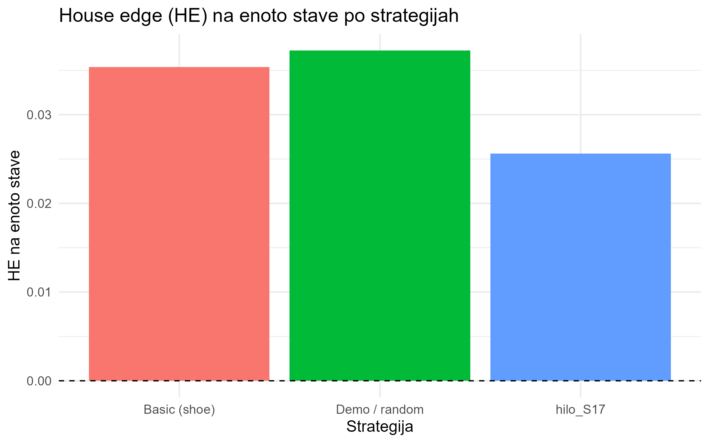
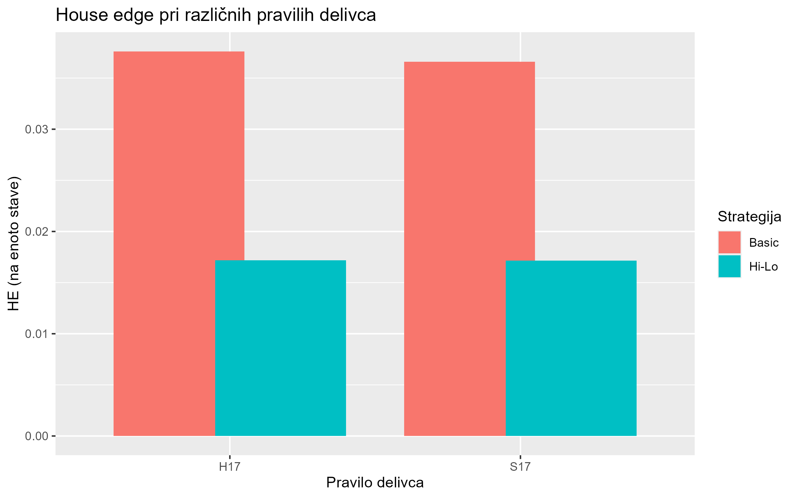
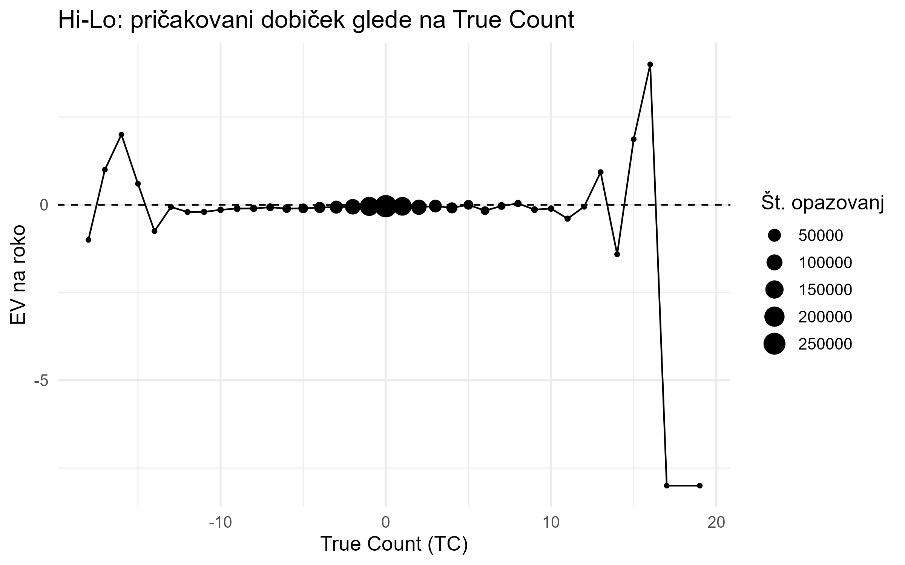

# 1. Igra in pravila (na kratko)

**Blackjack** je igra s kartami v kateri med seboj igrata igralec–delivec: cilj je biti bližje 21 toda ne več kot 21. Naravni 21 (A + 10/J/Q/K) ima posebno izplačilo.

**Kompleti in vrednosti kart:** igra se s standardnim kompletom (pogosto več njih v *shoe*).\
2–10 → vrednost = številka; J/Q/K → 10; A → 1 ali 11 (mehka roka, *soft*).

**Potek:** 1) razdelitev dveh kart (delivčeva *upcard* je vidna),\
2) morebiten naravni blackjack,\
3) igralčeve poteze: *hit*, *stand*, *double*, *split*, *surrender* (če je dovoljeno),\
4) delivec vleče do ≥17; pri **H17** vleče tudi na *soft 17*, pri **S17** ne,\
5) primerjava (zmaga/poraz/*push*).

**Parametri, ki jih spreminjamo v simulacijah:** število kompletov, različne strategije igralca(demo/osnovna/napredna), H17/S17, izplačilo za BJ (3:2 ali 6:5), *surrender*, double, split, penetracija (delež odigranih kart pred mešanjem).

**Metrike:** dobiček na stavo $G$, verjetnosti izidov (win/lose/push), volatilnost (aka. standardni odklon), več v nadaljevanju.\
**House edge:** $\mathrm{HE}=-\mathbb{E}[G]$. Negativen $\mathbb{E}[G]$ pomeni prednost hiše. Ta enakost velja kadar je \$G\$ dobiček na roko pri stavi 1. Ker pa imamo tudi implementirano pravilo double in kasneje napredno Hi-Lo strategijo, je bolj smiselno gledati \$HE_per_bet\$, torej house edhe na enoto vložka, ki jo izračunamo na naslednji način: $$HE_{\text{per bet}} = -\frac{\mathbb{E}[G]}{\mathbb{E}[\text{bet}]}$$

------------------------------------------------------------------------

# 2. Strategije igranja

## 2.1 Uvod in oznake

Strategija določa, **kako igralec izbira poteze** na podlagi stanja igre. Stanje formalno:

$$
s = (V_P, V_D, S_P, P_P)
$$kjer:

\- $V_P$ — vsota igralčevih kart (ase štejemo kot 1 ali 11),\
- $V_D$ — delivčeva vidna karta (*upcard*),\
- $S_P$ — indikator mehke roke (TRUE, če as šteje kot 11),\
- $P_P$ — indikator para (možen *split*).

Strategija je funkcija:

$$
\pi(s) = a, \quad a \in \{\text{hit}, \text{stand}, \text{double}, \text{split}, \text{surrender}\}.
$$

## 2.2 Vrste strategij

| Tip strategije                     | Opis                                                                           | Namen                   |
|------------------|-------------------------------------|------------------|
| **Naključna (demo verzija)**       | Poteze brez logike.                                                            | Kontrolni primer.       |
| **Osnovna (Basic)**                | Optimalna glede na pričakovani izid, brez štetja kart.                         | Standard v simulacijah. |
| **Napredna/Hi-Lo (z Hi-Lo count)** | Uporabi dodatne informacije (npr. štetje kart) za prilagoditev potez in stave. | Poveča dolgoročni $EV$. |

V nadaljevanju uporabljamo **osnovno strategijo**.

**Opomba**: Napredna strategija je osnovna strategija z različnim bet spreadom, ki se spreminja v odvisnosti od zgodovine že odigranih kart iz kupčka.

## 2.3 Matematični model odločanja

Pričakovani dobiček poteze $a$ v stanju $s$:

$$
EV(s,a) = \sum_{s'} P(s' \mid s,a)\, R(s,a,s'),
$$

kjer je $P(\cdot)$ verjetnost prehoda, $R(\cdot)$ izplačilo. Optimalna poteza:

$$
\pi^*(s) = \arg\max_a EV(s,a).
$$

V praksi tabelo $\pi^*$ dobimo z DP ali simulacijo → **tabela osnovne strategije**. (Za namen tega projekta je dovolj, da vzamemo že narejeno iz interneta)

## 2.4 Osnovna strategija (izsek za *hard* roke)

Vira (Tabela osnovnih strategij):

<https://www.blackjackonlineigra.eu/article/tabela-za-osnovno-strategijo-igranja-blackjacka>

<https://www.blackjackapprenticeship.com/blackjack-strategy-charts/>

**Nastavitve:** 6 kompletov kart, S17 (*dealer stands on soft 17*), dodan tudi H17

**Legenda:**\
- **H** = *Hit*\
- **S** = *Stand*\
- **D** = *Double* (če ni možno, vzemi *Hit*)\
- **Ds** = *Double* (če ni možno, vzemi *Stand*)\
- **P** = *Split*\
- **R** = *Surrender*

Tabela prikazuje optimalne poteze, ko delivec igra poS17 pravilih, za igralčeve *hard totals*(roka brez asa ali z asom, ki šteje kot 1).\
Soft roke in pari so v ločenih tabelah, in potem še ločene tabele kadar delivec igra po pravilih H17.

### Hard totals (osnovna strategija)

| Igralčeva vsota |  2  |  3  |  4  |  5  |  6  |  7  |  8  |  9  | 10  |  A  |
|----------------:|:---:|:---:|:---:|:---:|:---:|:---:|:---:|:---:|:---:|:---:|
|      8 ali manj |  H  |  H  |  H  |  H  |  H  |  H  |  H  |  H  |  H  |  H  |
|               9 |  H  |  D  |  D  |  D  |  D  |  H  |  H  |  H  |  H  |  H  |
|              10 |  D  |  D  |  D  |  D  |  D  |  D  |  D  |  D  |  H  |  H  |
|              11 |  D  |  D  |  D  |  D  |  D  |  D  |  D  |  D  |  D  |  H  |
|              12 |  H  |  H  |  S  |  S  |  S  |  H  |  H  |  H  |  H  |  H  |
|           13–16 |  S  |  S  |  S  |  S  |  S  |  H  |  H  |  H  |  H  |  H  |
|      17 ali več |  S  |  S  |  S  |  S  |  S  |  S  |  S  |  S  |  S  |  S  |

*Opomba:* Pari (npr. 10–10, 8–8, A–A) in *soft* roke (A+X) imajo ločene sezname optimalnih potez

------------------------------------------------------------------------

## 2.5 Napredna strategija — štetje kart (Hi–Lo)

**Hi–Lo** je klasična metoda štetja kart, kjer se vsaki karti dodeli vrednost:

-   **+1:** 2, 3, 4, 5, 6\
-   **0:** 7, 8, 9\
-   **−1:** 10, J, Q, K, A

S tem nastane **tekoči count (RC)**:

$$
RC = \sum \text{vrednosti vseh do sedaj videnih kart}
$$

Ker je v igri več kompletov kart (npr. 6), je potrebno popraviti pristranskost z deljenjem:

### **True Count**

$$
TC = \frac{RC}{\text{decks remaining}}
$$

kjer je število preostalih kompletov ocenjeno kot:

$$
\text{decks_remaining} = (\text{total_cards} - \text{pos} + 1) / 52.
$$

### Interpretacija TC

Pri $TC>0$ ima igralec statistično prednost → poveča stavo; pri $TC<0$ stavi minimalno.

-   **TC \< 0**: v preostalih kartah je *preveč malih kart* → igralec je v slabšem položaju\
    → *stavi minimum*\
-   **TC ≈ 0**: približno pošteno (se zmeraj kar minimum stavimo)\
-   **TC \> 0**: v preostalih kartah je *več desetk in asov* → igralec ima prednost\
    → *povečuje stavo*

V našem Monte Carlo modelu uporabljamo preprost bet spread (primer):

-   TC ≤ 0 → 1× osnovna stava\
-   1 ≤ TC \< 2 → 2×\
-   2 ≤ TC \< 3 → 4×\
-   TC ≥ 3 → 8×

S tem lahko simuliramo vpliv štetja kart na pričakovani dobiček (EV).

## 2.6 Povzetek

-   Strategija je $\pi(s)$, ki maksimizira $EV(s,a)$.\
-   V simulacijah uporabljamo **osnovno strategijo**; parametre pravil (H17/S17, izplačila, št. kompletov) spreminjamo.

## 2.7 Implementacija osnovne strategije v R

Osnovna strategija je v kodi implementirana preko funkcije:

``` r
basic_action_bs(player_vals, dealer_up, can_double, can_split, bs_table)
```

ki glede na igralčevo roko, delivčevo *upcard* in pravila igre (H17 ali S17), ter ali so dovoljeni double,split, surrender. Glede na pravila igre in začetno stanje nato izbere optimalno potezo iz prej omenjene CSV tabele odločanja.

Uporabljam dve ločeni tabeli osnovne strategije:

-   `basic_strategy.csv` — pravila za **S17** (*dealer stands on soft 17*)
-   `basic_strategy_H17.csv` — pravila za **H17** (*dealer hits soft 17*)

Vsaka vrstica v CSV vsebuje: - tip roke, aka. `player_group` (`hard`, `soft`, `pair`) - igralčevo vrednost (`player_total` ali `pair_rank`) - delivčevo karto (`dealer_up`) - optimalno akcijo (`H, S, D, Ds, P, R`)

Postopek izvajanja:

1\. roka se razvrsti med *hard*, *soft* ali *pair*

2\. iz ustrezne CSV se izbere optimalna vrstica

3\. akcijska koda se prevede v potezo (*hit*, *stand*, *double*, *split*, *surrender*)

Pravila H17/S17 preklapljamo zgolj z izbiro druge CSV tabele.

------------------------------------------------------------------------

# 3. Simulacijski model in metrike

## 3.1 Struktura simulacije

Simulacija ima dva nivoja:

### (1) Simulacija ene roke

Funkciji `deal_hand_from_shoe()` in `deal_hand_from_shoe_hilo()` izvedeta:\
1. začetno deljenje (P1, D_up, P2, D_hole)\
2. preverjanje blackjacka\
3. igralčevo igro po osnovni strategiji\
4. delivčevo igro po pravilih H17 ali S17\
5. izračun dobička roke\
6. beleženje dogodkov:\
- blackjack igralca / delivca\
- bust igralca / delivca\
- surrender\
- double\
- pri Hi–Lo: posodobitev tekočega counta (running count)

### (2) Monte Carlo simulacija (N zaporednih rok)

-   `simulate_with_shoe()` — osnovna strategija, fiksna stava
-   `simulate_with_shoe_hilo()` — strategija + Hi–Lo štetje + bet spread

Obe simulaciji: - inicializirata *shoe* z dano penetracijo - pred vsako roko preverita, ali je treba ponovno premešati - zbirata izide v vektor `gains` - beležita indikatorje (BJ, bust, double, surrender) - izračunata statistične metrike

------------------------------------------------------------------------

## 3.2 Metrike, ki jih vračata simulaciji

### 3.2.1 Osnovne statistike dobička

Pričakovani dobiček na roko:

$$
EV = \frac{1}{N}\sum_{i=1}^{N} G_i
$$

House edge na roko:

$$
HE_{\text{per hand}} = -EV
$$

House edge na enoto vložka:

$$
HE_{\text{per bet}} = -\frac{\mathbb{E}[G]}{\mathbb{E}[\text{bet}]}
$$ Varianca in standardni odklon:

$$
SD = \sqrt{\mathrm{Var}(G)}
$$

Standardna napaka ocene:

$$
SE = \frac{SD}{\sqrt{N}}
$$

95% interval zaupanja:

$$
EV \pm 1.96 \cdot SE
$$

Pri Hi–Lo simulaciji dodatno:

$$
EV_{100} = 100 \cdot EV
$$

------------------------------------------------------------------------

### 3.2.2 Porazdelitev osnovnih izidov

-   **Win rate:**\
    $$ P(G > 0) $$
-   **Loss rate:**\
    $$ P(G < 0) $$
-   **Push rate:**\
    $$ P(G = 0) $$

------------------------------------------------------------------------

### 3.2.3 Posebni dogodki (frekvence)

Simulacija meri:\
- blackjack igralca\
- blackjack delivca\
- surrender\
- bust igralca\
- bust delivca\
- double\
in vrača True oziroma False kot rezultat.

------------------------------------------------------------------------

### 3.2.4 Bankroll in tveganje

Potek kapitala:

$$
\text{bankroll}(i) = \sum_{k=1}^{i} G_k
$$

Drawdown (padec od lokalnega maksimuma):

$$
DD(i) = \max_{j \le i} \text{bankroll}(j) - \text{bankroll}(i)
$$

Največji drawdown:

$$
\text{MaxDD} = \max_i DD(i)
$$

------------------------------------------------------------------------

### 3.2.5 Hi–Lo specifične metrike

Tekoči count:

$$
C = \sum \text{(vrednosti vseh do sedaj videnih kart)}
$$

True count:

$$
TC = \frac{C}{\text{decks remaining}}
$$

kjer:

$$
\text{decks remaining} = \frac{\text{total_cards} - \text{pos} + 1}{52}
$$

ROI — donos na vložek:

$$
ROI = \frac{\sum_i G_i}{\sum_i \text{bet}_i}
$$

Pogojni EV glede na TC:

$$
EV(TC = t) = \mathbb{E}[G \mid \text{round}(TC) = t]
$$

------------------------------------------------------------------------

## 3.3 Povzetek simulacijskega dela

-   Osnovna strategija je implementirana preko CSV tabel (S17, H17)
-   Simulaciji `simulate_with_shoe()` in `simulate_with_shoe_hilo()` izvajata realistično Monte Carlo simulacijo blackjacka z mešanjem glede na penetracijo
-   Izračunane so metrike: EV, SD, SE, 95% CI, frekvence BJ/bust/double/surrender, potek bankrolla, max drawdown
-   Hi–Lo razširitev vključuje: running count, true count, bet spread, ROI, EV po TC
-   Te metrike omogočajo analizo vpliva pravil igre ter oceno prednosti pri štetju kart

# 4. Primerjava strategij in rezultati simulacij

V nadaljevanju primerjam rezultate Monte Carlo simulacij. Privzeto uporabljam:

-   6 kompletov kart (*n_decks = 6*)
-   **S17** (dealer stoji na soft 17), razen tam kjer primerjam S17 vs H17
-   *double* in *surrender* sta dovoljena
-   *split* je privzeto izklopljen (ker implementacija ni popolnoma zaključena, recimo nisem implementiral Double after Spilt in ReSplit) in ga vključim samo pri posebni primerjavi
-   izplačilo blackjacka 3:2 (*payout_bj = 1.5*)
-   velikost vzorca: $N = 10^6$

-\> EV_per_hand pove, koliko povprečno dobimo/izgubimo na eno roko (pri negativni vrednosti dolgoročno izgubljamo).

-\> Pri Hi–Lo je EV_per_hand lahko bolj negativen, ker so stave višje (večja volatilnost), zato se bolj splača gledati HE_per_bet.

-\> HE_per_bet je bolj “poštena” primerjava, ker pove izgubo na enoto vložka. Nižji HE_per_bet pomeni boljši rezultat za igralca.

-\> Pri Hi–Lo je povprečna stava (avg_bet) večja, zato je smiselno primerjati tudi ROI. Primerjava strategij (demo vs basic vs Hi-Lo)

## 4.1 Primerjava strategij: demo vs basic vs Hi–Lo

Najprej primerjam tri strategije pri istih pravilih:

-   **Demo / random**: kontrolni primer, naključno igranje
-   **Basic (shoe)**: osnovna strategija iz CSV tabel (S17/H17)
-   **Hi–Lo (shoe + spread)**: štetje kart + prilagajanje stave (bet spread)

| Strategija            | $EV_{\text{per hand}}$ | $HE_{\text{per hand}}$ | $HE_{\text{per bet}}$ |     $ROI$ | $\overline{\text{bet}}$ |
|------------|-----------:|-----------:|-----------:|-----------:|-----------:|
| Demo / random         |              -0.037238 |               0.037238 |              0.037238 | -0.037238 |                   1.000 |
| Basic (shoe)          |              -0.040783 |               0.040783 |              0.035375 | -0.035375 |                   1.153 |
| Hi-Lo (shoe + spread) |              -0.055703 |               0.055703 |              0.025605 | -0.025605 |                   2.176 |

Naključna strategija predstavlja referenčni primer brez uporabe kakršnegakoli znanja o igri. Pričakovani dobiček na roko je izrazito negativen, kar pomeni visoko prednost hiše.

Osnovna strategija bistveno izboljša rezultate v primerjavi z naključnim igranjem. Čeprav je $EV$ še vedno negativen, in celo slabši od naključne strategije, se house edge na enoto stave zmanjša, kar pomeni počasnejše dolgoročne izgube.

Hi–Lo strategija ima na prvi pogled najslabši $EV$ na roko, vendar to ni ustrezna metrika za primerjavo. Zaradi večjih stav pri ugodnih situacijah (visok *true count*) se poveča povprečna stava, kar vpliva na absolutni dobiček na roko.

Ključni kazalnik je $HE_{\text{per_bet}}$, ki je pri Hi–Lo strategiji najnižji. To pomeni, da igralec na enoto vloženega denarja izgublja najmanj, kar je tudi osnovni cilj štetja kart.

-   Naključno igranje vodi do največjih izgub.

-   Osnovna strategija znatno zmanjša prednost hiše, vendar igre ne naredi poštene.

-   Hi–Lo strategija zmanjša house edge na enoto stave, čeprav poveča povprečno velikost vložka.

-   Za pozitivni $EV$ bi bile potrebne dodatne izboljšave (večja penetracija, bolj agresiven *bet spread*, *index plays*).

Na podlagi simulacij lahko zaključimo, da štetje kart ne zagotavlja dobitka v vsaki igri, vendar dolgoročno izboljša položaj igralca v primerjavi z osnovno strategijo.

## 4.2 Primerjava pravil delivca: S17 vs H17

### a) Basic strategy

V tej sekciji primerjam, kako sprememba delivčevega pravila vpliva na rezultate:

-   **S17**: delivec stoji na *soft 17*
-   **H17**: delivec vleče tudi na *soft 17*

Za primerljivost uporabim vse ostale parametre enake ter enak `set.seed()` in velikost vzorca $N$.

```{r basic_s17_h17_table, echo=FALSE, message=FALSE, warning=FALSE}

df_basic_rules <- data.frame( pravilo = c("S17", "H17"), EV = c(-0.042195, -0.043469), SE = c(0.001163088, 0.001163590), HE_per_bet = c(0.03660209, 0.03761544), avg_bet = c(1.152803, 1.155616) )

knitr::kable(df_basic_rules, digits = 6,
             caption = "Hi–Lo strategija: primerjava S17 vs H17 (isti seed, isti N)")
```

Pri **H17** ima delivec malo več “opcij”, ker lahko vleče tudi na *soft 17*. To v povprečju nekoliko poveča prednost hiše, zato je pričakovani dobiček igralca (**EV**) malo bolj negativen, prav tako je nekoliko višji **HE_per_bet**.

### b) Hi-Lo strategy

V tem razdelku primerjamo pravilo delivca pri **Hi–Lo strategiji s stavnim razponom**.\
Spremenjeno je samo pravilo delivca (S17 vs H17), vsi ostali parametri in `set.seed()` so enaki.

```{r hilo_s17_h17_table, echo=FALSE, message=FALSE, warning=FALSE}
df_hilo_rules <- data.frame(
  pravilo     = c("S17", "H17"),
  EV          = c(-0.037442, -0.037592),
  HE_per_bet  = c(0.01713557, 0.01717364),
  ROI         = c(-0.01713557, -0.01717364),
  avg_bet     = c(2.185046, 2.188936)
)

knitr::kable(df_hilo_rules, digits = 6,
             caption = "Hi–Lo strategija: primerjava S17 vs H17 (isti seed, isti N)")
```

Tudi pri Hi–Lo strategiji je pravilo **H17** nekoliko slabše za igralca.\
Razlika v **EV** in **HE_per_bet** je majhna, vendar konsistentna: ko delivec vleče na *soft 17*, ima v povprečju rahlo več možnosti za izboljšanje svoje roke.

Zanimivo je, da je pri Hi–Lo absolutni **EV na roko** še vedno negativen, vendar je **house edge na enoto vložka (HE_per_bet)** bistveno manjši kot pri osnovni strategiji.\
To pomeni, da igralec pri štetju kart v povprečju izgublja počasneje, predvsem zato, ker več stavi v ugodnih situacijah (visok *true count*).

## 4.3 Vpliv pravil: double / surrender / split

V tej sekciji analiziramo, kako se pričakovani izid spremeni, če določena pravila igre dovolimo ali prepovemo.\
Primerjave so narejene ločeno za osnovno strategijo in za Hi–Lo strategijo.

Uporabljena pravila:

-   **Double**: igralec lahko podvoji stavo, vendar dobi točno še eno karto.
-   **Surrender**: igralec lahko takoj odstopi in izgubi polovico stave.
-   **Split**: ob paru lahko razdeli roko na dve ločeni roki.

------------------------------------------------------------------------

### 4.3.1 Double pri osnovni strategiji

Najprej pogledamo vpliv pravila *double* pri osnovni strategiji.

```{r basic_double_table, echo=FALSE, message=FALSE, warning=FALSE}
df_basic_double <- data.frame(
  double       = c("ON", "OFF"),
  EV_per_hand  = c(-0.037770, -0.023965),
  HE_per_bet   = c(0.03276115, 0.02396500 ),
  avg_bet      = c(1.15289     , 1.00000     ),
  double_rate =  c(0.15289, 0.00000)
)

knitr::kable(
  df_basic_double,
  digits = 6,
  caption = "Osnovna strategija: vpliv pravila double"
)
```

Na prvi pogled se zdi, da omogočeno podvajanje poslabša rezultat. House edge na enoto vložka je večji, ko je *double* dovoljen.

Za boljše razumevanje poglejmo še ločeno pričakovani izid **na stavo** za roke, kjer je bil *double* dejansko uporabljen:

-   **EV na stavo (doubled roke)**: −0.0152\
-   **EV na stavo (brez doubled rok)**: −0.0391

To pomeni, da so *double roke same po sebi bistveno manj slabe* kot povprečna roka brez podvajanja.

**Razlaga:**\
Double je lokalno dobra odločitev – v situacijah, kjer jo osnovna strategija priporoča, res zmanjša pričakovano izgubo.\
Vendar pa omogočeno podvajanje **poveča povprečni vložek**, saj igralec v približno 15 % primerov stavi dvojno vsoto. Ker je celotna igra še vedno negativna, to vodi do hitrejšega izgubljanja kapitala.

------------------------------------------------------------------------

### 4.3.2 Surrender pri osnovni strategiji

```{r basic_surrender_table, echo=FALSE, message=FALSE, warning=FALSE}
df_basic_surrender <- data.frame(
surrender = c("ON", "OFF"),
EV = c(-0.042530 , -0.042635 ),
HE_per_bet = c(0.03691167        , 0.03703269        ),
surrender_rate = c(0.07794, 0.00000)
)

knitr::kable(
df_basic_surrender,
digits = 6,
caption = "Osnovna strategija: vpliv pravila surrender"
)
```

Omogočen *surrender* jasno izboljša rezultat. Igralec se v približno 8 % primerov odloči za predajo in s tem zmanjša izgube v zelo neugodnih situacijah.

Surrender je eno izmed pravil, ki imajo pozitiven vpliv na house edge.

------------------------------------------------------------------------

### 4.3.3 Split pri osnovni strategiji

```{r basic_split_table, echo=FALSE, message=FALSE, warning=FALSE}
df_basic_split <- data.frame(
split = c("ON", "OFF"),
EV = c(-0.031755 , -0.042530 ),
HE_per_bet = c(0.02745951, 0.03691167)
)

knitr::kable(
df_basic_split,
digits = 6,
caption = "Osnovna strategija: vpliv pravila split"
)
```

Delitev parov (*split*) izboljša pričakovani izid. S tem se igralec izogne zelo slabim kombinacijam (npr. 16 proti močni dealerjevi karti) in razdeli tveganje na dve roki.

------------------------------------------------------------------------

### 4.3.4 Double in surrender pri Hi–Lo strategiji

Pri Hi–Lo strategiji so opazni podobni vzorci kot pri osnovni strategiji.

```{r hilo_double_table, echo=FALSE, message=FALSE, warning=FALSE}

df_hilo_double <- data.frame(
double = c("ON", "OFF"),
EV = c(-0.036305 , -0.029185 ),
HE_per_bet = c(0.01647292    , 0.01548407    ),
HE_per_hand = c(0.036305 , 0.029185 ),
ROI = c(-0.01647292     , -0.01548407),
double_rate = c(0.15289, 0.00000)
)

knitr::kable(
df_hilo_double,
digits = 6,
caption = "Hi–Lo strategija: vpliv pravila double"
)
```

Čeprav Hi–Lo prilagaja višino stave, omogočeno podvajanje brez dodatnih prilagoditev potez (t. i. *index plays*) poslabša skupni izid. Double se pogosto zgodi v situacijah z višjo stavo, kjer osnovna strategija še ne izkorišča popolne prednosti pozitivnega true counta.

```{r hilo_surrender_table, echo=FALSE, message=FALSE, warning=FALSE}

df_hilo_surrender <- data.frame(
surrender = c("ON", "OFF"),
EV = c(-0.056645 , -0.064545 ),
HE_per_bet = c(0.02625176    , 0.02996810    ),
HE_per_hand = c(0.056645 , 0.064545 ),
ROI = c(-0.02625176        , -0.02996810        ),
surrender_rate = c(0.07794, 0.00000)
)

knitr::kable(
df_hilo_surrender,
digits = 6,
caption = "Hi–Lo strategija: vpliv pravila surrender"
)
```

Tudi pri Hi–Lo surrender občutno zmanjša izgube, saj igralec omeji škodo v najslabših situacijah.

------------------------------------------------------------------------

### 4.3.5 Povzetek vpliva pravil

-   *Double* je lokalno dobra poteza, vendar zaradi povečanja povprečnega vložka poslabša skupni rezultat (ker je kot rečeno osnovna igra že sama po sebi negativna).
-   *Surrender* dosledno izboljša house edge tako pri osnovni strategiji kot pri Hi–Lo.
-   *Split* omogoča boljše obvladovanje slabih začetnih kombinacij.
-   Pri Hi–Lo strategiji brez dodatnih prilagoditev potez (index plays) sama sprememba višine stave še ne zadošča za pozitiven EV.

### 4.3.6 Ekstremni pogoji igre: »best« vs »worst« scenarij (Hi–Lo)

Za konec sekcije pogledamo še dva namerno ekstremna scenarija, ki ponazarjata, kako močno lahko pravila in pogoji igre vplivajo na pričakovani izid, tudi brez uporabe dodatnih optimizacij (npr. index plays).

V obeh primerih uporabljamo Hi–Lo štetje kart, razlika pa je tako v *pravilih* igre kot v strukturi *shoe-a*.

```{r hilo_extreme_table, echo=FALSE, message=FALSE, warning=FALSE}
df_hilo_extreme <- data.frame(
  pravila      = c("Best-case", "Worst-case"),
  EV           = c( 0.014560 ,  -0.051346  ),
  HE_per_bet   = c(-0.005421588   ,  0.033577253    ),
  HE_per_hand  = c(-0.014560  ,   0.051346 ),
  ROI          = c( 0.005421588, -0.033577253),
  avg_bet      = c(2.68556, 1.52919)  
)

knitr::kable(
  df_hilo_extreme,
  digits = 6,
  caption = "Hi–Lo strategija: primerjava najboljših in najslabših pogojev igre"
)
```

*Best-case scenarij vključuje:*

-   2 kompleta kart,

-   visoko penetracijo (90 %),

-   pravilo S17,

-   standardno izplačilo za blackjack (3:2).

-   in vsa pravila (double, split, surrender)

V tem primeru se house edge obrne v korist igralca, čeprav strategija še vedno uporablja zgolj osnovna pravila brez prilagoditev potez glede na true count.

*Worst-case scenarij vključuje:*

-   6 kompletov kart,

-   nizko penetracijo (50 %),

-   pravilo H17,

-   znižano izplačilo za blackjack (6:5).

-   in nobenega pravila (double, split, surrender)

V tem primeru je igra izrazito neugodna za igralca, Hi–Lo štetje pa lahko zgolj omeji izgube, ne pa jih izniči.

Ta primer jasno pokaže, da je pri blackjacku izbira pravil in pogojev igre vsaj tako pomembna kot sama strategija igranja.

## 4.4 Vpliv izplačila za blackjack (3:2 vs 6:5)

V tej sekciji analiziramo vpliv izplačila za **naravni blackjack**. Edina razlika med simulacijami je razmerje izplačila za blackjack (3:2 proti 6:5), medtem ko so strategija, pravila igre, število simulacij in začetni *seed* enaki.

Ker se razlika pokaže izključno ob pojavu blackjacka, je ta primer predvsem intuitiven, a hkrati zelo pomemben v praksi.

```{r basic_payout_table, echo=FALSE, message=FALSE, warning=FALSE}
df_basic_payout <- data.frame(
  payout_bj  = c("3:2", "6:5"),
  EV         = c(-0.035525 , -0.049103 ),
  HE_per_bet = c(0.03081788 , 0.04259677 ),
  bj_rate    = c(0.04725, 0.04725)
)

knitr::kable(
  df_basic_payout,
  digits = 6,
  caption = "Osnovna strategija: vpliv izplačila za blackjack (isti seed, isti N)"
)
```

```{r hilo_payout_table, echo=FALSE, message=FALSE, warning=FALSE}
df_hilo_payout <- data.frame(
payout_bj = c("3:2", "6:5"),
EV = c(-0.046140 , -0.074118 ),
HE_per_bet = c(0.02119557 , 0.03404797 ),
bj_rate = c(0.04725 , 0.04725 ),
avg_bet = c(2.17687, 2.17687)
)

knitr::kable(
df_hilo_payout,
digits = 6,
caption = "Hi–Lo strategija: vpliv izplačila za blackjack (isti seed, isti N)"
)
```

Pogostost blackjacka je v vseh simulacijah enaka.

Razlika v rezultatih izhaja izključno iz razmerja izplačila.

Izplačilo 6:5 bistveno poveča house edge, ne glede na strategijo igranja.

To potrjuje znano dejstvo, da je 6:5 blackjack ena najslabših možnih različic igre za igralca.

## 4.5 Vpliv penetracije na Hi–Lo strategijo

V tej sekciji analiziramo vpliv **penetracije čevlja** (*penetration*) na uspešnost Hi–Lo strategije.

Penetracija določa, kolikšen delež kart se odigra, preden pride do ponovnega mešanja (*reshuffle*). Višja penetracija pomeni, da ima igralec več informacij o sestavi preostalih kart, kar je ključno za štetje kart.

V vseh simulacijah so uporabljeni: - ista Hi–Lo strategija, - enak bet spread, - isti začetni *seed* in število simulacij (*N*), - ostala pravila igre nespremenjena.

```{r hilo_penetration_table, echo=FALSE, message=FALSE, warning=FALSE}
df_hilo_penetration <- data.frame(
  penetration = c(0.50, 0.75, 0.90),
  EV          = c(-0.058575 , -0.065315 , -0.026820 ),
  HE_per_bet  = c(0.03334871     , 0.02984614    , 0.01114829    ),
  HE_per_hand = c(0.058575 , 0.065315 , 0.026820 ),
  ROI         = c(-0.03334871 , -0.02984614 , -0.01114829 ),
  avg_bet     = c(1.75644, 2.18839, 2.40575)
)

knitr::kable(
  df_hilo_penetration,
  digits = 6,
  caption = "Hi–Lo strategija: vpliv penetracije čevlja (isti seed, isti N)"
)
```

Rezultati jasno pokažejo, da ima **višja penetracija pozitiven vpliv**\
na Hi–Lo strategijo:

-   Pri **penetraciji 0.50** se čevelj meša relativno zgodaj, zato ima štetje kart omejeno uporabno vrednost.

-   Pri **penetraciji 0.75** se povprečna stava poveča, vendar se EV na roko še celo poslabša (naključje?).

-   Pri **penetraciji 0.90** je house edge na enoto vložka občutno manjši, kar pomeni učinkovitejšo uporabo informacij iz true counta.

Višja penetracija omogoča:

-   stabilnejši true count,

-   bolj agresivno prilagajanje stave,

-   večjo prednost igralca pri ugodnih situacijah.

# 5 Grafi (Priloge)

V tem poglavju so zbrani grafični prikazi rezultatov Monte Carlo simulacij, ki dopolnjujejo numerične primerjave iz poglavja 4. Grafi služijo predvsem vizualni interpretaciji vpliva strategij, pravil igre in parametrov (penetracija, izplačila, Hi–Lo) ter omogočajo hitrejšo primerjavo trendov. Ker so rezultati že podrobno interpretirani v prejšnjem poglavju, so grafi tukaj predstavljeni brez dodatnih komentarjev.

# 5.1 Primerjava strategij

```{r fig_strategije, echo=FALSE, fig.align="center", out.width="50%"}

```

# 5.2 Primerjava S17vsH17

```{r fig_S17vsH17, echo=FALSE, fig.align="center", out.width="50%"}

```

# 5.3 Primerjava pravil igre (D/R/S) - za osnovno strategijo

```{r fig_rules, echo=FALSE, fig.show="hold", out.width="32%"}
knitr::include_graphics(c(
  "grafi/basic_double_ONvsOFF.png",
  
  "grafi/basic_surrender_ONvsOFF.png",
  
  "grafi/basic_split_ONvsOFF.png"
))
```

# 5.4 Primerjava izplačila BJ - za osnovno strategiijo

```{r fig_BJ_payout, echo=FALSE, fig.align="center", out.width="50%"}
knitr::include_graphics(
  "grafi/Basic_BJ_payoff.png")
```

# 5.5 Vpliv penetracije pri Hi-Lo strategiji

```{r fig_penetration_ef, echo=FALSE, fig.show="hold", out.width="32%"}
knitr::include_graphics(c(
  "grafi/hilo_penetration_vs_EV.png",
  "grafi/hilo_penetration_vs_HE.png",
  "grafi/hilo_penetration_vs_ROI.png"))
```

# 5.6 Primerjava Best vs Worst caswe - za napredno strategijo

```{r fig_BestvsWorst, echo=FALSE, fig.show="hold", out.width="50%"}
knitr::include_graphics(c(
  "grafi/BESTvsWORST.png",
  "grafi/BESTvsWORST_avg_bet_in_maxDD.png"))
```

# 5.7 EV glede na True Count - za napredno strategijo

```{r fig_EV_by_TC, echo=FALSE, fig.align="center", out.width="50%"}

```

# 5.8 Bankroll krivulja in histogram dobitkov - za napredno strategijo

```{r fig_bankroll_in_dobitki, echo=FALSE, fig.show="hold", out.width="50%"}
knitr::include_graphics(c(
  "grafi/Hilo_bankroll_skozi_time.png",
  "grafi/Hilo_porazdelitev_dobitkov.png"))
```
